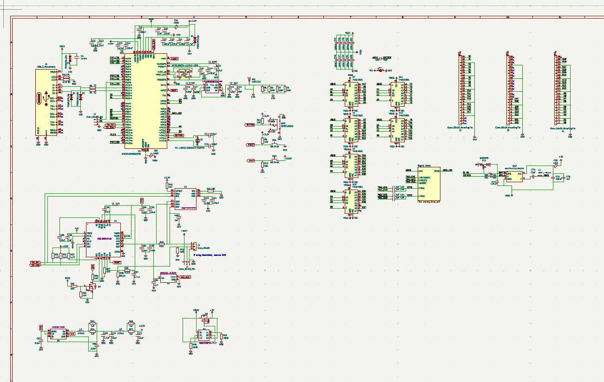

# July 20-22: Brainstorming and Research

I was initially inspired to start this project after the principal of my school promised me a Wacom One because of my academic excellence, but after some time I never recieved the tablet so I decided to make my own. I then looked up to see if I could find some inspiration and I found a YouTube video (<10K views) of someone actually making and studying the pencils from common drawing tablets.

EMR tablets work based off of inductors (coils) being able to b affected by magnetic fields and being able to turn such fields into electricity (ith some caveats). The tablet has a grid of coils ith AC current flowing through them, this alternation causes a magnetic field to form. THis magnetic field is especially useful because if another inductor coms close to the field, it can recive a bit of current and using a capacitor, it can be stored. This is the basic principle of how those pens manage to work without batteries.

I saw that he originally made on to convert a laptop into a drawing tablet so I kinda wanted to do the same but with some improvements:

- USB-C
- Bluetooth
- Custom software to configure

As the original tablet neded a wired connection I decided that this would be a fun challenge to tackle.

After looking through the repository on GitLab and opeing up th schematics for the tablet (more specifically the coil grid) I was greeted with this:

(look at all those coils)

While I could copy it, I wanted a tablet under 200mm and also to be able to understand it. So I looked through some patents that were refrenced in the YouTube video and found that that the coils could be made up of any number of turns, in this case 3 turns (better pen detection).

I plan on making 3 components, a flexible circuit that recives the signal from the pen, a central "motherboard" that processes the signal from the FPC, and finally a pen that can interact with the tablet.

# June 23: FPC Design

I started by using a script to make one side of the coils.

I then had to connect them in a way so that they looped around like in the original schematic

(orignal)

(mine after complting the horizontal coils)

# June 24: FPC continued...

After a while I got the Y-plane done

but thats when I recieved a response from the original creator about a question I had about the coil design. Originally th coils looked like this, and I had a question as to why the middle loop wasn't connected to anything. Apparently that was a bug... after all that wiring...

(old coil)

(new coil)

I asked few more questions that helped clarify things like the trace width and how to efficently connect all the components and got to work on a new design. (by hand)

After a few hours of tweaking I finally got the right design.

# June 25: Rewiring (again...)

After yesterday's fail I decided to take a break and then start the wiring again, I didn't make much progress today but I got both axis done.

# June 29: Finished FPC

FInally after working all day (took a few days off), I finally completed the FPC.

The supposed active area is 170x110mm which I think is pretty good.

Now I'm going to start research on the main board that connects to the FPC. I want it to have bluetooth and a good battery life so I chose the STM32WB55. I'll be using the Flipper Zero's schematics to wire it up as it uses the same chip.

# June 30: Main Board Schematic

After researching and compiling schematics, I started work on creating the schematic for the board that will handle the connection from the touchpad and also bluetooth. I took inspiration from the connections for power and battery from the FLipper Zero docs and also the analog circuits from Patchouli's repository.

# July 1: Main Board PCB

After finishing the schematic, I decided to take a break and plan what I had to do next in order of importance.

- Double triple check schematic
- Create main board PCB
- Fix FPC board to have 0.2mm trace spacing
- Create case in Fusion360
- (Optionally create pencil)

# July 3: Fix FPC Board

My OCD wouldn't let me move on until I'd fixed the board so I redid the coils and added everything again.

# July 5-: Main Board PCB (finally)

I started work on making the PCB and after watching a fe tutorials on analog signals and pcb design (thanks Phil's Lab) i felt confident in starting to design the PCB.
