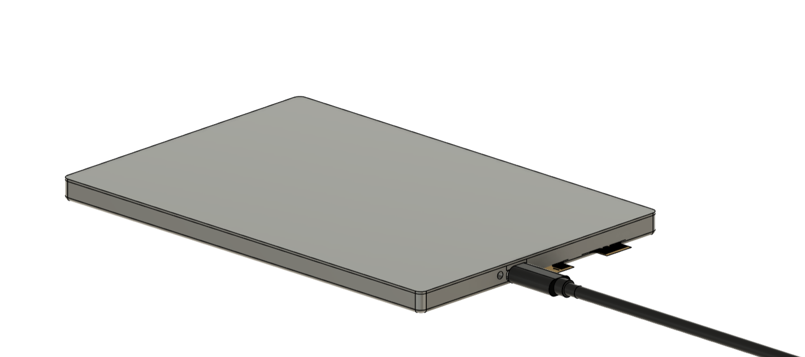
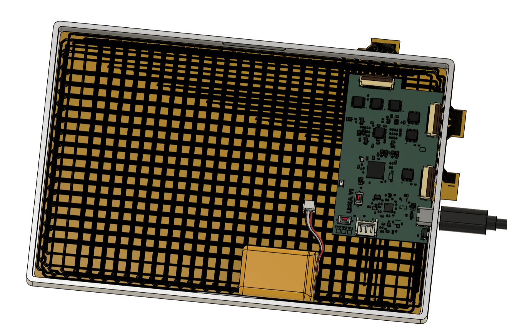
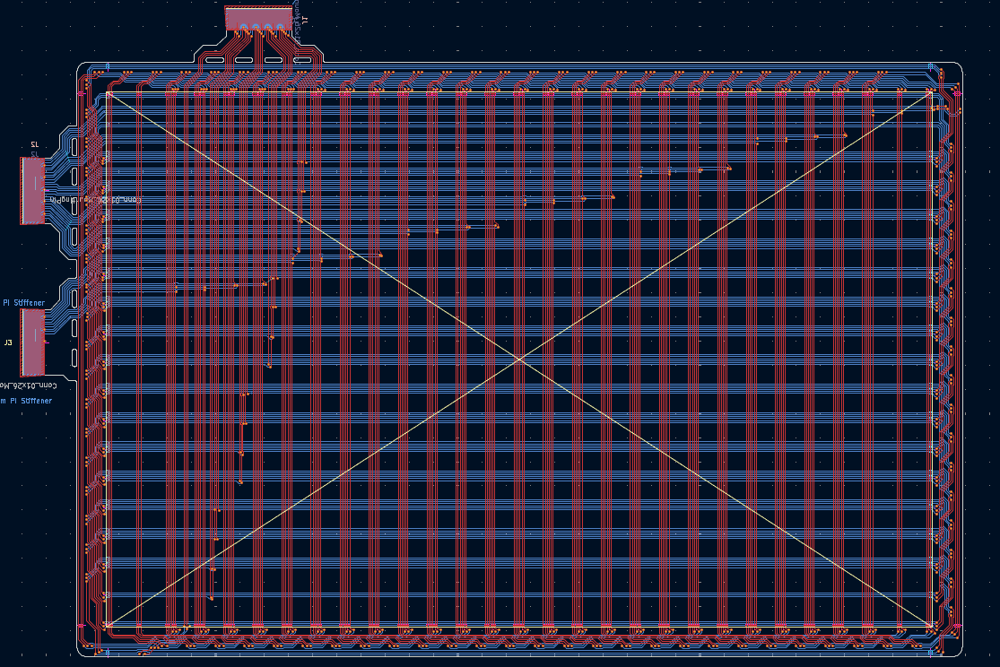
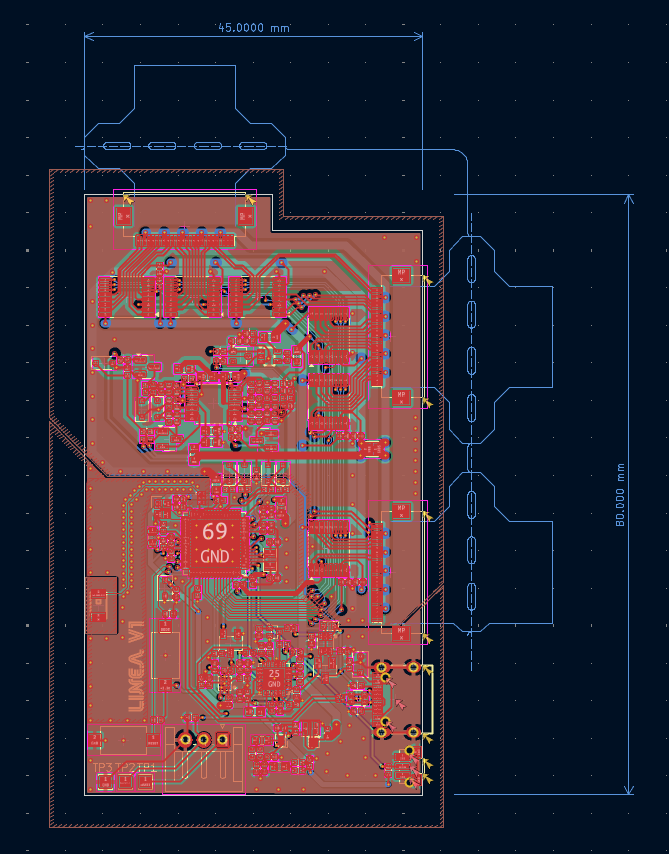
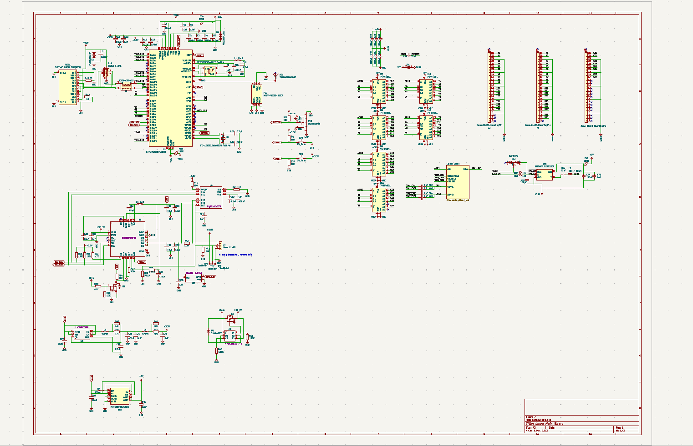
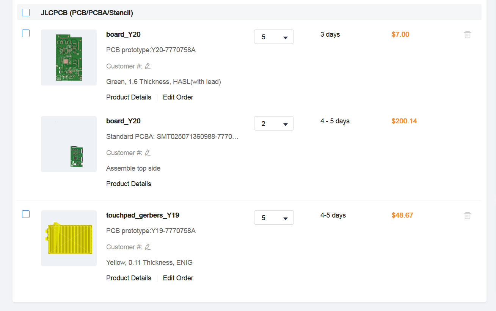

<h1 align="center">
   
  
   
  Linea
   
</h1>

<h4 align="center">Project files for a custom EMR tablet from scratch.</h4>

  <a href="#key-features">Key Features</a> •
  <a href="#case-and-cad">Case & CAD</a> •
  <a href="#pcb">PCB</a> •
  <a href="#bom">BOM</a> •
  <a href="#credits">Credits</a> •
  <a href="#license">License</a>

<!---

--->

## Key Features

- ~500kHz scanning rate
- Large (170x110mm) drawing area
- Bluetooth support (via STM32)
- USB-C for data and charging
- ~~Pen~~ (for another version)

## Case and CAD

The case includes:

- 3D printed parts: a base and a top cover
- Snap-fit case

Designed in Fusion 360.

## PCB

Designed in KiCad. Notable points:

- STM32WB55RGV6TR for bluetooth support
- LiPo battery charging circuit
- USB-C
- 2 ground planes
- FPC touchpad

The PCB has 2 components, the FPC coil grid and the main board.

## BOM

| Item         | Price (USD) | Source                                                                                                                                                                                                                                                                                                                                                                                                                                                          |
| ------------ | ----------- | --------------------------------------------------------------------------------------------------------------------------------------------------------------------------------------------------------------------------------------------------------------------------------------------------------------------------------------------------------------------------------------------------------------------------------------------------------------- |
| FPC Board    | 48.67       | JLCPCB                                                                                                                                                                                                                                                                                                                                                                                                                                                          |
| Main Board   | 207.14      | JLCPCB                                                                                                                                                                                                                                                                                                                                                                                                                                                          |
| Test Pen     | 22.91       | [Online Marketplace](https://articulo.mercadolibre.com.co/MCO-568567056-lapiz-repuesto-tabla-digitalizadora-xp-pen-p03-no-wacom-_JM?searchVariation=176600496495#is_advertising=true&searchVariation=176600496495&backend_model=search-backend&position=8&search_layout=stack&type=pad&tracking_id=9f203117-ca3d-40ac-bdf1-dadf37d1ff62&is_advertising=true&ad_domain=VQCATCORE_LST&ad_position=8&ad_click_id=YjFjZWVmY2UtZGUwNi00Y2Y4LTk2NDktMmQ1NjNhZGUyMzNj) |
| **Subtotal** | 278.72      |                                                                                                                                                                                                                                                                                                                                                                                                                                                                 |
| **Shipping** | 30.00       | Estimated                                                                                                                                                                                                                                                                                                                                                                                                                                                       |
| **Total**    | 308.72      |                                                                                                                                                                                                                                                                                                                                                                                                                                                                 |

## Credits

This project uses:

- [KiCad](https://www.kicad.org/)
- [STM32MX](https://www.st.com/en/development-tools/stm32cubemx.html)
- [Fusion 360](https://www.autodesk.com/products/fusion-360/overview)

## You may also like...

- [Niveles De Niveles](https://github.com/NotARoomba/NivelesDeNiveles) – Real-time flood alert app
- [ROCKETMEN](https://github.com/NotARoomba/ROCKETMEN) – Custom flight controller files
- [Tamaki](https://github.com/NotARoomba/Tamaki) – A cute HackPad

## License

MIT

---

> [notaroomba.dev](https://notaroomba.dev) &nbsp;&middot;&nbsp;
> GitHub [@NotARoomba](https://github.com/NotARoomba)
